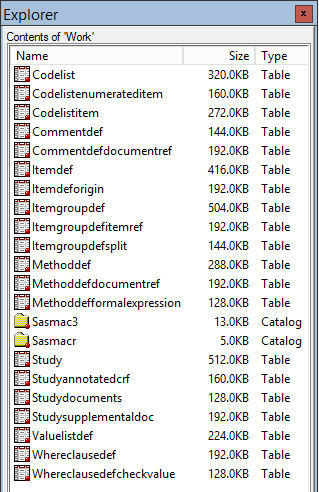
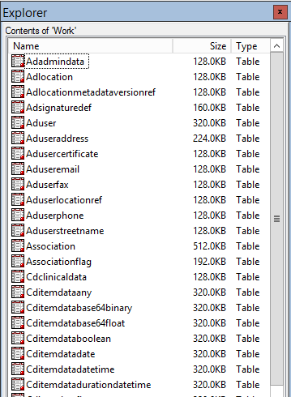

# About The Project
For one and a half decade I have sought high and low for a (set of) SAS XMLMAP(s) to convert CDISC ODM-xml and define-xml files into SAS datasets for building metadata driven processes to report and analyze clinical trials. After way too much patience I decided to build them myself. 

The define-xml can serve as a one source of truth for the definition of SDTM and ADaM data specifications. Define-xml was originally developed as a documentation tool, but by feeding the dog it’s own tail, it can do much more than this acting as a definition document. The idea for define-xml is to have a specification document to allow SDTM and ADaM datasets to be built in an automated way. SAS being the (still) preferred analysis tool in the pharma industry, such automation calls for a conversion of the metadata within define-xml to be converted to SAS datasets. Furthermore, the define-xml itself as a specification can be handed over to any external data provider (CRO) as a definition of expected deliverables. Once the data is delivered, a new define-xml can be produced from the data package using any available tool to do so, and the resulting define-xml can the be compared to the specification one, to measure any gaps between the specification and the delivery. Such a XML comparison tool is not part of this project.

## Built With
The SAS XMLMAPS for converting any CDISC ODM-xml file and CDISC define-xml files into SAS datasets is build using the freely available SAS XML Mapper tool in its original configuration as it comes as a download from sas.com. No tweaking or java upgrades were performed. The SAS XML Mapper is available from SAS Institute at [SAS Downloads: SAS XML Mapper](https://support.sas.com/downloads/package.htm?pid=486). You will need to register at the SAS web page to get the download. This tool creates an XML document in a particular format for defining SAS datasets from an example XML source file and an optional XML schema file. The main engine in the process is the XPATH language as known from other contexts.

#### Versions covered are:
* Define-xml version 2.0.0.
* SAS version 9.2 and above.

# Getting Started
Download the documents and place them at the location where they are needed

## XML Maps
The XMLMAP files can reside anywhere on your computer or system. The only requirement is that they are available to the SAS program that wants to use them.  Then write a SAS program along these lines:
> `filename define “<your drive>:\<your path>\<your define file.xml>”;`  
> `filename xmlmap “<your drive>:\<your path>\define_2_0_0.map”;`  
> `libname  define xmlv2 xmlmap=xmlmap access=READONLY compat=yes;`  

Please pay attention to the specific options to the `libname` statement. Please note that the **fileref** for the XML file must be identical to **libref** of the `libname` statement as per the SAS documentation of the XML (and XMLV2) engines of the `libname` statement.

These three statements creates a libref to the XML document enabling SAS to read all datasets defined in the XMLMAP as SAS datasets.

## Prerequisites
SAS/Base software minimum version 9.2. If you are running in a SAS 9.2 session, use the alias XML92 as the XML engine name in place of XMLV2.

# Usage
### define_2_0_0.map
This document is a piece of XML defining how to interpret a valid CDSIC define-xml file as a set of SAS datasets defining metadata for a clinical trial. Both SDTM and ADaM is supported. The resulting datasets can be used to easily implement a datamodel widely used for clinical trial metadata.

Example program:

> `filename define “W:\XML Mapper\SDTM Define-XML 2.0.xml”;`  
> `filename xmlmap “W:\XML Mapper\define_2_0_0.map”;`  
> `libname  define xmlv2 xmlmap=xmlmap access=READONLY compat=yes;`  
>  
> `proc copy in=define out=work;`  
> `run;`  

The result is a copy of all the datasets defined in the `define_2_0_0.map` file, which has an XPATH representation within the define-xml file. These files can be used for further processing in SAS to build the complete metadata for a collection of SDTM or ADaM datasets, depenent of the contents of the define-xml file.

### odm_1_3_2.map
This document is a piece of XML defining how to interpret a valid CDSIC ODM-xml file as a set of SAS datasets defining metadata for a clinical trial. The resulting datasets can be used to display an SDTM annotated CRF, as well as pruning SDTM metadata to comply with a corresponding CRF.

Example program:

> `filename odm “W:\XML Mapper\CDISC odm 1.3.2.xml”;`  
> `filename map “W:\XML Mapper\odm_1_3_2.map”;`  
> `libname  odm xmlv2 xmlmap=xmlmap access=READONLY compat=yes;`  
>  
> `proc copy in=odm out=work;`  
> `run;`  

The result is a copy of all the datasets defined in the `odm_1_3_2.map` file, which has an XPATH representation within the ODM-xml file. These files can be used for further processing in SAS to build a rendition of the CRF, of coorelating the contents of define-xml and ODM_xml.

# Roadmap
As new version of ODM-xml and define-xml are published by CDISC, I hope to be able to write new versions of relevant documents for these.

Futhermore, I am very willing to take advise on how to improve my simple-style coding.

I am considering to write XSL Translating Style Sheets to replace the XML maps, to be able to include more business logic for creating a more coherent data model. This may not require another XML Map, as the target could be one of the simple data models built into the XMLV2 engine.

# License
Distributed under the MIT License. See [LICENSE](https://github.com/jmangori/CDISC-ODM-and-Define-XML-tools/blob/master/LICENSE) for more information.

# Contact
Jørgen Mangor Iversen [jmi@try2.info](mailto:jmi@try2.info)

[My web page in danish](http://www.try2.info) unrelated to this project.

[My LinkedIn profile](https://www.linkedin.com/in/jørgen-iversen-ab5908b/)

